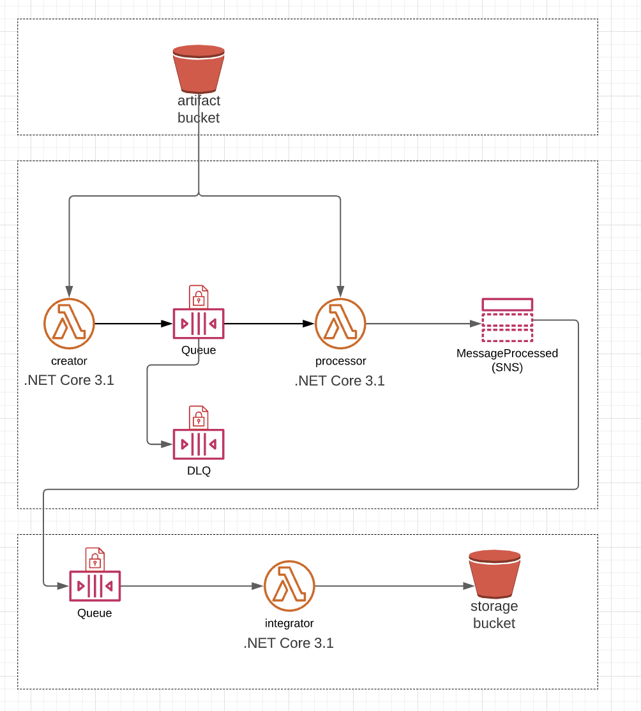

## AWS Terraform Solution:

### Overview:
I want a small .net core app running in a creator lambda function that when invoked, writes a message to sqs. Another lambda (`processor` lambda) grabs the message and publishes it to SNS with an email topic subscription.  The second part is an integration stack.  This will have another SQS queue which subscribed to the SNS topic in the main stack.  I want a lambda to receive the message from this integration queue and write the message to a S3 `storage` bucket.

### Instructions:

In order to achieve the above we would like to make use of Terraform to create the above resources in AWS. You can do this in a single TF file or split them up.  We wan to send a message to the creator lambda for example:

``` 
[
  {
    "eventType": "CREATE",
    "message": "value1"
  }
]
```

#### Possible EventTypes include:

- "CREATE" - Will be processed successfully.
- "UPDATE" - Will be processed successfully.
- "DLQ" - This type of event should be sent to the DLQ.
- "ERROR" - This type of event or any other unknown event should throw an exception.

### Ensure you supply the following deliverables:

   - Host the [Terraform state in a S3 bucket](https://www.howtoforge.com/how-to-manage-terraform-state-in-aws-s3-bucket/).  

   - artifact `S3 bucket`
   - Storage `S3 bucket`  
   - `IAMUser` with policy,
   - `KMSKey`  (Everything except the `integration queue` should be encrypted using this KMS key.),

   - IAMRole,
   - `Lambdas` that read code from artifact bucket,
   - A `SQS` Queue and a Deadletter Queue
   - `SNS topic` with one email and one sms `subscription`

   - Integration Queue which will receive a event from SNS
   - A Integration Lambda which will receive a event from the integration queue
   - The Integration lambda will write the event message to the storage bucket.

**Our end goal is to create this:**



